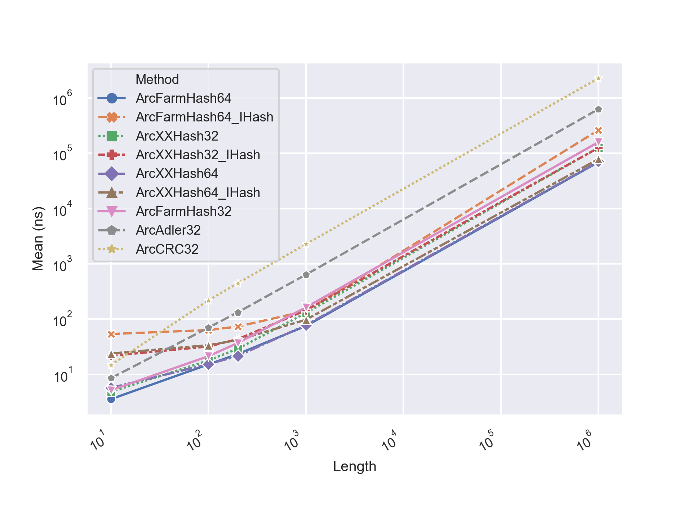
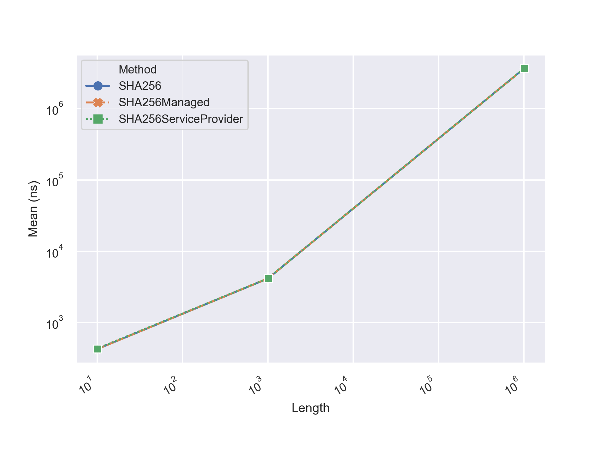
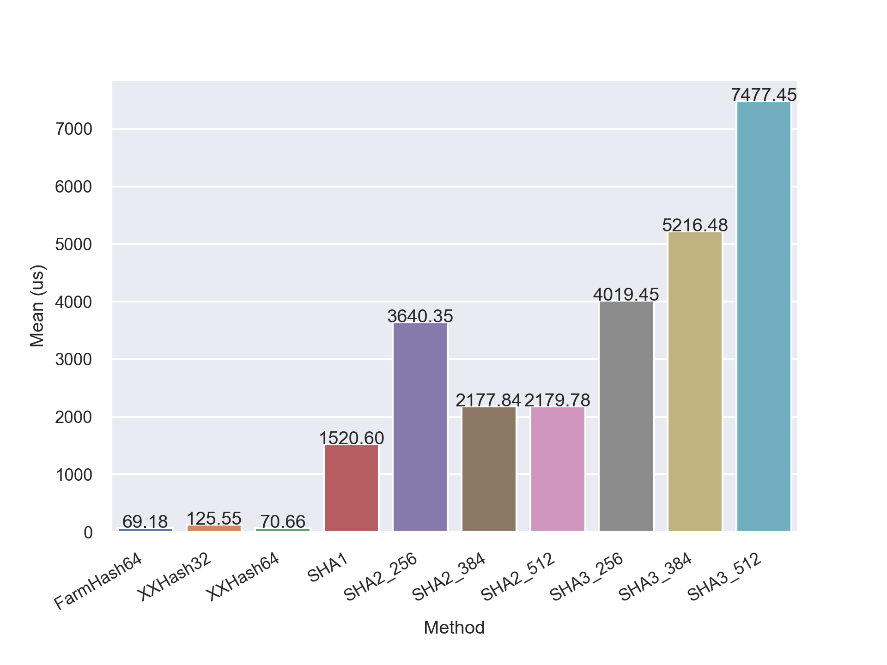
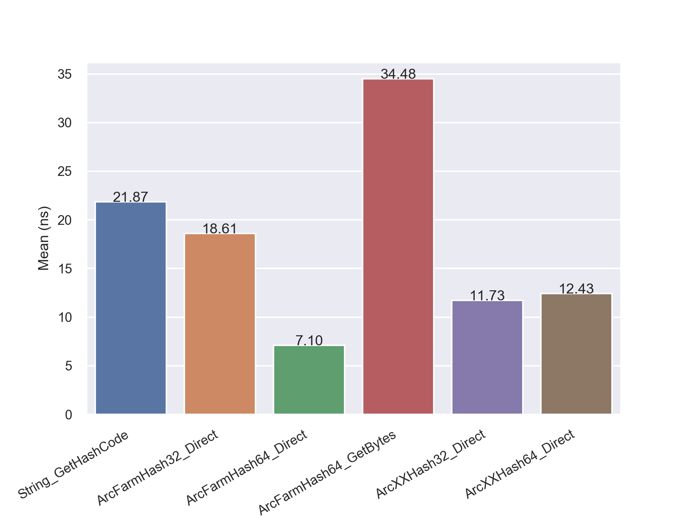

## Arc.Crypto
 

Arc.Crypto is a collection of classes used in cryptography, which includes

- Hash functions (XXHash, FarmHash, SHA)
- Pseudo-random generator (Mersenne Twister)


## Quick Start

```
Install-Package Arc.Crypto
```

Sample code

```csharp
using Arc.Crypto;
```

```csharp
var data = new byte[100];
ulong hash64;
uint hash32;
byte[] array;

hash64 = Arc.Crypto.FarmHash.Hash64(data.AsSpan()); // The fastest and best algorithm.
hash64 = Arc.Crypto.XXHash64.Hash64(data.AsSpan()); // As fast as FarmHash.
hash32 = Arc.Crypto.FarmHash.Hash32(data.AsSpan()); // 32 bit version is slower than 64 bit version.
hash32 = Arc.Crypto.XXHash32.Hash32(data.AsSpan()); // Same as above.
hash32 = unchecked((uint)Arc.Crypto.FarmHash.Hash64(data.AsSpan())); // I recommend getting 64 bit and discarding half.
hash32 = Arc.Crypto.Adler32.Hash32(data.AsSpan()); // Slow
hash32 = Arc.Crypto.CRC32.Hash32(data.AsSpan()); // Slowest

// IHash is an interface to get a hash of large data.
// For XXHash64, IHash version is a bit slower than static method version.
// For FarmHash64, IHash version is twice as slow. XXHash64 is recommended.
var ihash = new Arc.Crypto.XXHash64();
ihash.HashInitialize();
ihash.HashUpdate(data);
Assert.True(ihash.HashFinal().SequenceEqual(ihash.GetHash(data)));

// Secure Hash Algorithm (SHA1, SHA2, SHA3 supported)
var sha3_512 = new Arc.Crypto.SHA3_512();
array = sha3_512.GetHash(data.AsSpan());

sha3_512.HashInitialize(); // Another way
sha3_512.HashUpdate(data.AsSpan());
Assert.True(sha3_512.HashFinal().SequenceEqual(array));
```

```csharp
public void QuickStart_MersenneTwister()
{
    // MersenneTwister is a pseudo-random number generator.
    // Faster and better than System.Random.
    var mt = new MersenneTwister(42);
    var ul = mt.NextULong(); // [0, 2^64-1]
    var d = mt.NextDouble(); // [0,1)
    var bytes = new byte[10];
    mt.NextBytes(bytes);
}
```


## Benchmark

### PseudoRandomBenchmark


| Method        |       Mean |     Error |    StdDev | Gen 0 | Gen 1 | Gen 2 | Allocated |
| ------------- | ---------: | --------: | --------: | ----: | ----: | ----: | --------: |
| Random_Int    |   8.613 ns | 0.0066 ns | 0.0062 ns |     - |     - |     - |         - |
| MT_Int        |   2.504 ns | 0.0046 ns | 0.0038 ns |     - |     - |     - |         - |
| MT_ULong      |   4.578 ns | 0.0190 ns | 0.0169 ns |     - |     - |     - |         - |
| Random_Double |   9.163 ns | 0.0039 ns | 0.0032 ns |     - |     - |     - |         - |
| MT_Double     |   5.490 ns | 0.0260 ns | 0.0243 ns |     - |     - |     - |         - |
| Random_Range  |  21.080 ns | 0.0764 ns | 0.0714 ns |     - |     - |     - |         - |
| MT_Range      |   6.345 ns | 0.0032 ns | 0.0025 ns |     - |     - |     - |         - |
| Random_Bytes  | 154.626 ns | 0.1338 ns | 0.1117 ns |     - |     - |     - |         - |
| Mt_Bytes      |  17.064 ns | 0.0187 ns | 0.0166 ns |     - |     - |     - |         - |


### HashTest.HashBenchmark



IHash version uses HashInitialize() HashUpdate() HashFinal() functions to process data sequentially. Thus it's capable of calculating a hash of large data. But IHash version is slower than GetHash() version.

FarmHash64 is the fastest in most cases. XXHash64 is the second. 32 bit version is slower than 64bit version. 

The advantage of XXHash is that IHash version is as fast as GetHash() version. XXHash is a bit slower than FarmHash, but XXHash is still very competitive.


| Method              | Length      |              Mean |           Error |          StdDev |  Gen 0 | Gen 1 | Gen 2 | Allocated |
| ------------------- | ----------- | ----------------: | --------------: | --------------: | -----: | ----: | ----: | --------: |
| **ArcFarmHash64**   | **10**      |      **3.570 ns** |   **0.0089 ns** |   **0.0079 ns** |  **-** | **-** | **-** |     **-** |
| ArcFarmHash64_IHash | 10          |         53.820 ns |       0.8947 ns |       0.8369 ns | 0.0076 |     - |     - |      32 B |
| ArcXXHash32         | 10          |          4.825 ns |       0.0117 ns |       0.0098 ns |      - |     - |     - |         - |
| ArcXXHash32_IHash   | 10          |         21.725 ns |       0.1083 ns |       0.1013 ns | 0.0076 |     - |     - |      32 B |
| ArcXXHash64         | 10          |          5.707 ns |       0.0193 ns |       0.0171 ns |      - |     - |     - |         - |
| ArcXXHash64_IHash   | 10          |         23.874 ns |       0.0426 ns |       0.0356 ns | 0.0076 |     - |     - |      32 B |
| ArcFarmHash32       | 10          |          5.174 ns |       0.0115 ns |       0.0107 ns |      - |     - |     - |         - |
| ArcAdler32          | 10          |          8.546 ns |       0.0243 ns |       0.0227 ns |      - |     - |     - |         - |
| ArcCRC32            | 10          |         14.822 ns |       0.0587 ns |       0.0521 ns |      - |     - |     - |         - |
| **ArcFarmHash64**   | **100**     |     **15.174 ns** |   **0.0586 ns** |   **0.0519 ns** |  **-** | **-** | **-** |     **-** |
| ArcFarmHash64_IHash | 100         |         63.492 ns |       0.1421 ns |       0.1187 ns | 0.0076 |     - |     - |      32 B |
| ArcXXHash32         | 100         |         17.890 ns |       0.0322 ns |       0.0301 ns |      - |     - |     - |         - |
| ArcXXHash32_IHash   | 100         |         32.032 ns |       0.0783 ns |       0.0654 ns | 0.0076 |     - |     - |      32 B |
| ArcXXHash64         | 100         |         15.356 ns |       0.0935 ns |       0.0829 ns |      - |     - |     - |         - |
| ArcXXHash64_IHash   | 100         |         33.765 ns |       0.0388 ns |       0.0344 ns | 0.0076 |     - |     - |      32 B |
| ArcFarmHash32       | 100         |         21.340 ns |       0.0796 ns |       0.0706 ns |      - |     - |     - |         - |
| ArcAdler32          | 100         |         70.160 ns |       0.1284 ns |       0.1072 ns |      - |     - |     - |         - |
| ArcCRC32            | 100         |        218.149 ns |       0.3879 ns |       0.3629 ns |      - |     - |     - |         - |
| **ArcFarmHash64**   | **200**     |     **23.319 ns** |   **0.0608 ns** |   **0.0508 ns** |  **-** | **-** | **-** |     **-** |
| ArcFarmHash64_IHash | 200         |         73.331 ns |       0.7773 ns |       0.7271 ns | 0.0076 |     - |     - |      32 B |
| ArcXXHash32         | 200         |         29.133 ns |       0.0136 ns |       0.0120 ns |      - |     - |     - |         - |
| ArcXXHash32_IHash   | 200         |         43.384 ns |       0.1245 ns |       0.1039 ns | 0.0076 |     - |     - |      32 B |
| ArcXXHash64         | 200         |         21.509 ns |       0.0712 ns |       0.0666 ns |      - |     - |     - |         - |
| ArcXXHash64_IHash   | 200         |         41.898 ns |       0.1552 ns |       0.1452 ns | 0.0076 |     - |     - |      32 B |
| ArcFarmHash32       | 200         |         37.041 ns |       0.0099 ns |       0.0082 ns |      - |     - |     - |         - |
| ArcAdler32          | 200         |        132.813 ns |       0.0403 ns |       0.0336 ns |      - |     - |     - |         - |
| ArcCRC32            | 200         |        446.706 ns |       0.0855 ns |       0.0667 ns |      - |     - |     - |         - |
| **ArcFarmHash64**   | **1000**    |     **75.198 ns** |   **0.3413 ns** |   **0.3192 ns** |  **-** | **-** | **-** |     **-** |
| ArcFarmHash64_IHash | 1000        |        140.334 ns |       0.6233 ns |       0.4866 ns | 0.0076 |     - |     - |      32 B |
| ArcXXHash32         | 1000        |        129.226 ns |       0.0680 ns |       0.0531 ns |      - |     - |     - |         - |
| ArcXXHash32_IHash   | 1000        |        144.865 ns |       0.5206 ns |       0.4870 ns | 0.0076 |     - |     - |      32 B |
| ArcXXHash64         | 1000        |         77.887 ns |       0.1772 ns |       0.1571 ns |      - |     - |     - |         - |
| ArcXXHash64_IHash   | 1000        |         97.538 ns |       0.3822 ns |       0.3191 ns | 0.0076 |     - |     - |      32 B |
| ArcFarmHash32       | 1000        |        163.361 ns |       0.0481 ns |       0.0376 ns |      - |     - |     - |         - |
| ArcAdler32          | 1000        |        637.942 ns |       1.2846 ns |       1.1387 ns |      - |     - |     - |         - |
| ArcCRC32            | 1000        |      2,273.253 ns |       0.3518 ns |       0.3119 ns |      - |     - |     - |         - |
| **ArcFarmHash64**   | **1000000** | **69,147.517 ns** | **161.2336 ns** | **134.6373 ns** |  **-** | **-** | **-** |     **-** |
| ArcFarmHash64_IHash | 1000000     |    262,080.347 ns |   1,541.7221 ns |   1,366.6965 ns |      - |     - |     - |      32 B |
| ArcXXHash32         | 1000000     |    125,445.389 ns |     103.3090 ns |      86.2677 ns |      - |     - |     - |         - |
| ArcXXHash32_IHash   | 1000000     |    125,445.174 ns |      48.2100 ns |      37.6392 ns |      - |     - |     - |      32 B |
| ArcXXHash64         | 1000000     |     70,592.503 ns |      34.3731 ns |      28.7031 ns |      - |     - |     - |         - |
| ArcXXHash64_IHash   | 1000000     |     78,590.161 ns |     187.3559 ns |     175.2528 ns |      - |     - |     - |      32 B |
| ArcFarmHash32       | 1000000     |    159,305.595 ns |      60.3141 ns |      50.3650 ns |      - |     - |     - |       2 B |
| ArcAdler32          | 1000000     |    628,652.269 ns |     171.7670 ns |     143.4333 ns |      - |     - |     - |       1 B |
| ArcCRC32            | 1000000     |  2,267,708.984 ns |     604.1038 ns |     471.6445 ns |      - |     - |     - |       3 B |


### HashTest.SHA256Benchmark



The performance of SHA256 / SHA256Managed / SHA256ServiceProvider is identical.

| Method                | Length      |               Mean |           Error |          StdDev |      Gen 0 | Gen 1 | Gen 2 | Allocated |
| --------------------- | ----------- | -----------------: | --------------: | --------------: | ---------: | ----: | ----: | --------: |
| **SHA256**            | **10**      |       **426.1 ns** |     **3.31 ns** |     **3.09 ns** | **0.0267** | **-** | **-** | **112 B** |
| SHA256Managed         | 10          |           425.2 ns |         1.55 ns |         1.38 ns |     0.0267 |     - |     - |     112 B |
| SHA256ServiceProvider | 10          |           432.5 ns |         3.38 ns |         3.16 ns |     0.0267 |     - |     - |     112 B |
| **SHA256**            | **1000**    |     **4,152.1 ns** |    **40.24 ns** |    **37.64 ns** | **0.0229** | **-** | **-** | **112 B** |
| SHA256Managed         | 1000        |         4,155.7 ns |        29.67 ns |        27.76 ns |     0.0229 |     - |     - |     112 B |
| SHA256ServiceProvider | 1000        |         4,170.1 ns |        30.87 ns |        28.87 ns |     0.0229 |     - |     - |     112 B |
| **SHA256**            | **1000000** | **3,639,069.8 ns** | **4,305.29 ns** | **4,027.17 ns** |      **-** | **-** | **-** | **117 B** |
| SHA256Managed         | 1000000     |     3,636,769.1 ns |     1,617.45 ns |     1,350.64 ns |          - |     - |     - |     117 B |
| SHA256ServiceProvider | 1000000     |     3,640,355.4 ns |     5,804.64 ns |     4,847.14 ns |          - |     - |     - |     148 B |


### HashTest.SpeedBenchmark



Non-cryptographic hash functions (FarmHash, XXHash) are much faster then cryptographic hash functions (SHA series).


| Method     |        Mean |     Error |   StdDev | Gen 0 | Gen 1 | Gen 2 | Allocated |
| ---------- | ----------: | --------: | -------: | ----: | ----: | ----: | --------: |
| FarmHash64 |    69.18 us |  0.091 us | 0.080 us |     - |     - |     - |      33 B |
| XXHash32   |   125.55 us |  0.241 us | 0.225 us |     - |     - |     - |      33 B |
| XXHash64   |    70.66 us |  0.043 us | 0.040 us |     - |     - |     - |      33 B |
| SHA1       | 1,520.60 us |  3.190 us | 2.984 us |     - |     - |     - |      99 B |
| SHA2_256   | 3,640.35 us |  6.718 us | 6.284 us |     - |     - |     - |     117 B |
| SHA2_384   | 2,177.84 us |  1.301 us | 1.087 us |     - |     - |     - |     149 B |
| SHA2_512   | 2,179.78 us |  4.792 us | 4.248 us |     - |     - |     - |     181 B |
| SHA3_256   | 4,019.45 us |  1.477 us | 1.233 us |     - |     - |     - |      56 B |
| SHA3_384   | 5,216.48 us |  1.532 us | 1.279 us |     - |     - |     - |      72 B |
| SHA3_512   | 7,477.45 us | 10.309 us | 8.609 us |     - |     - |     - |      88 B |


### HashTest.StringBenchmark

