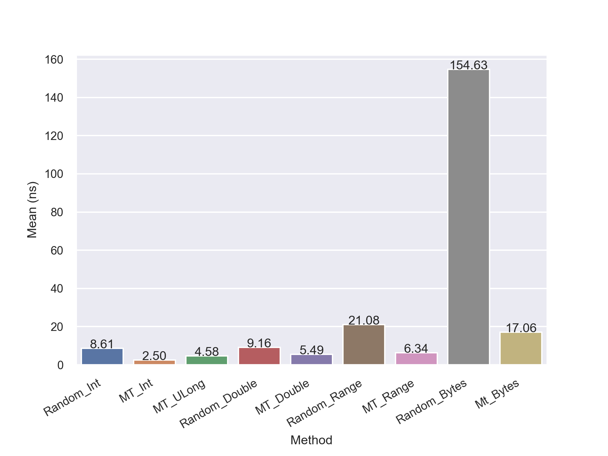
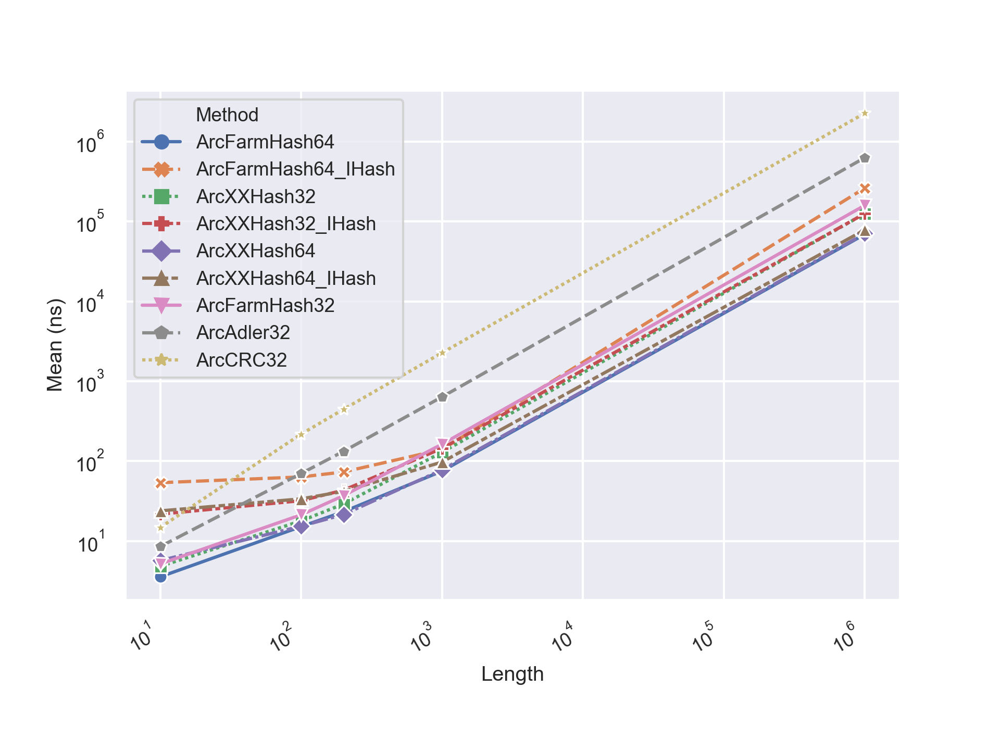
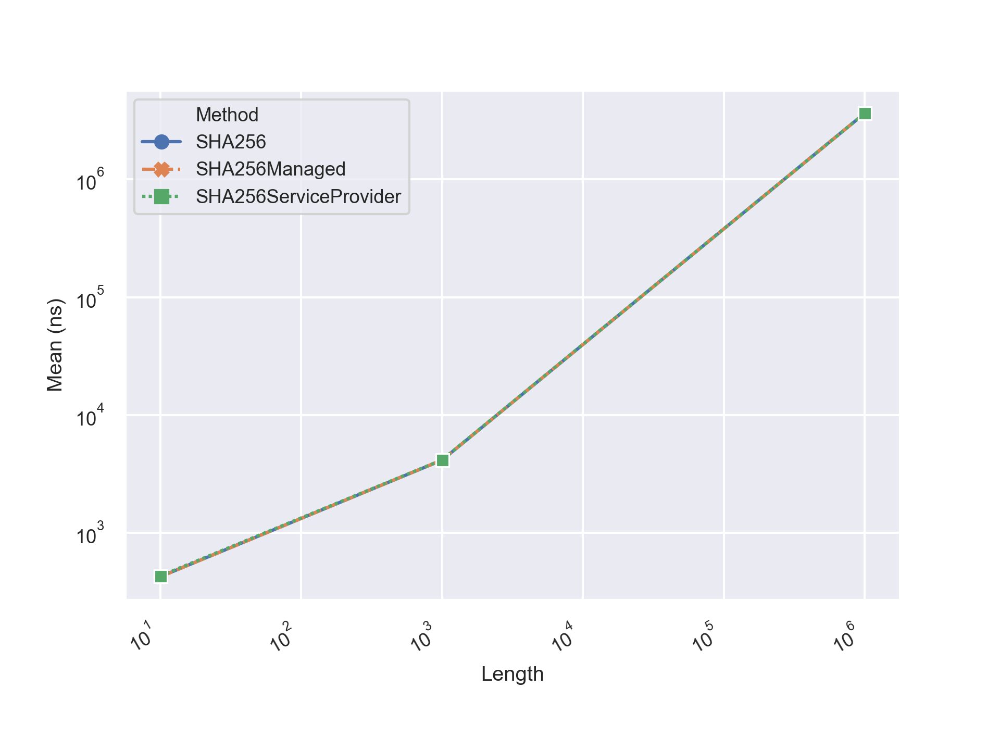
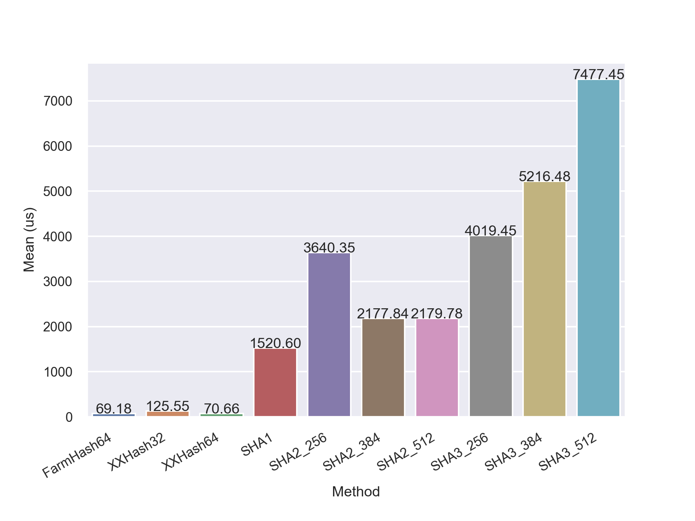
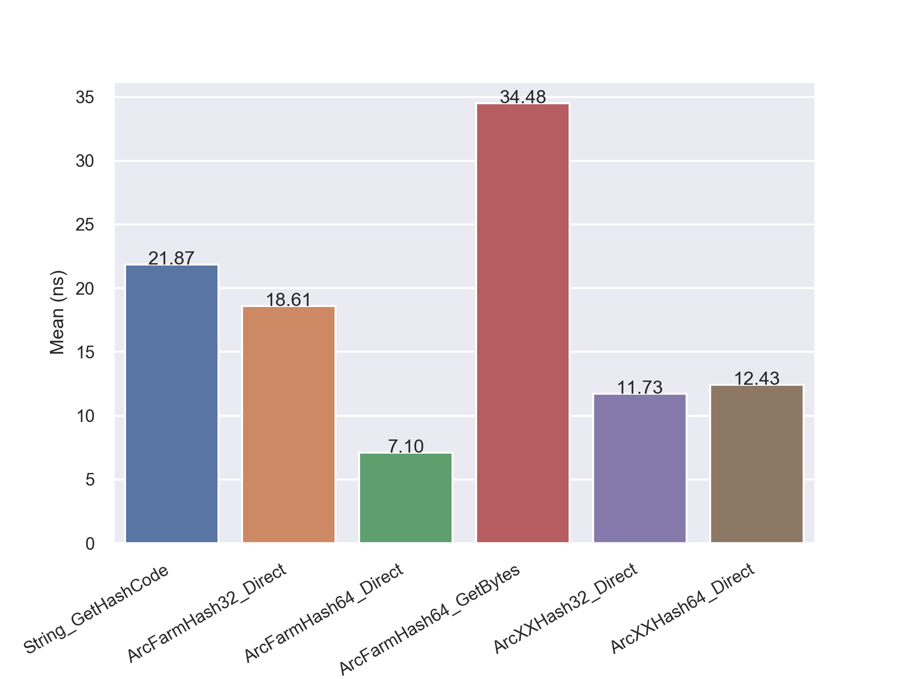

## Arc.Crypto
**Arc.Crypto** is a library equipped with various features related to cryptography.

- Authenticated encryption (AEGIS-256, AEGIS-128L, XSalsa20-Poly1305)
- Password-based encryption and key derivation (PasswordEncryption, Argon2id)
- Public-key signatures and key exchange (Ed25519, Ed25519ph, X25519, secp256k1, secp256r1)
- Cryptographic hash functions (BLAKE3, BLAKE2b, SHA-2, SHA-3)
- Non-cryptographic hash functions (FarmHash, xxHash3, xxHash, Adler-32, CRC-32)
- Pseudo-random generators (xoshiro256\*\*, xoroshiro128\*\*, Xorshift, Mersenne Twister)
- Cryptographically secure random generator (AegisRandom)
- Thread-safe random number pool (RandomVault)
- Encoding (Hex, Base64, url-safe Base64, sortable Base32)
- String comparers for hashtables (Utf8StringEqualityComparer, Utf16StringEqualityComparer)

The library targets .NET 10 and uses [Libsodium](https://doc.libsodium.org/) and [BLAKE3](https://github.com/BLAKE3-team/BLAKE3) through native interop.

The assembly is trim-safe and Native AOT compatible: it contains no reflection, and both native dependencies are plain P/Invoke. Publishing with `PublishAot` or `PublishTrimmed` produces no trim or AOT analysis warnings, and CI publishes and runs an AOT binary on every push. The two native libraries ship as RID-specific assets, so `dotnet publish -r <rid>` places them next to the application automatically.


## Quick Start

```
Install-Package Arc.Crypto
```

```csharp
using Arc.Crypto;
```

Types that take a fixed-size key or nonce carry the size in the parameter name (`key32`, `nonce24`), and the corresponding `KeySize` / `NonceSize` constants are exposed on each class. Spans of the wrong length are rejected with an exception rather than being silently truncated.


### Encryption

```csharp
// AEGIS-256 (key 32 bytes, nonce 32 bytes) and AEGIS-128L (key 16, nonce 16)
// are very fast authenticated ciphers.
var message = "Message"u8;
Span<byte> key = stackalloc byte[Aegis256.KeySize];
Span<byte> nonce = stackalloc byte[Aegis256.NonceSize];
RandomVault.Default.NextBytes(key);
RandomVault.Default.NextBytes(nonce);

// The ciphertext holds the message plus the authentication tag.
var cipher = new byte[message.Length + Aegis256.MinTagSize];
Aegis256.Encrypt(cipher, message, nonce, key);

var decrypted = new byte[message.Length];
var result = Aegis256.TryDecrypt(decrypted, cipher, nonce, key); // true

// XSalsa20-Poly1305 via Libsodium.
Span<byte> secretBoxKey = stackalloc byte[CryptoSecretBox.KeySize];
Span<byte> secretBoxNonce = stackalloc byte[CryptoSecretBox.NonceSize];
CryptoSecretBox.CreateKey(secretBoxKey);
RandomVault.Default.NextBytes(secretBoxNonce);
var box = new byte[message.Length + CryptoSecretBox.MacSize];
CryptoSecretBox.Encrypt(message, secretBoxNonce, secretBoxKey, box);
var opened = new byte[message.Length];
CryptoSecretBox.TryDecrypt(box, secretBoxNonce, secretBoxKey, opened);
```

A nonce must never be reused with the same key. `Aegis128L` and `Aegis256` accept a tag size of 16 or 32 bytes, or 0 to encrypt without authentication.


### PasswordEncryption

```csharp
// PasswordEncryption derives a key with Argon2id and encrypts with AEGIS-256.
var data = new byte[] { 0, 1, 2, };
PasswordEncryption.Encrypt(data, "correct", out var encrypted);

var result = PasswordEncryption.TryDecrypt(encrypted, "correct", out var decrypted); // true
var failure = PasswordEncryption.TryDecrypt(encrypted, "incorrect", out _); // false

// Argon2id can also be used directly for key derivation and password storage.
var hashString = CryptoPasswordHash.GetHashString("password");
var verified = CryptoPasswordHash.VerifyHashString(hashString, "password"); // true
```

The encrypted data is the plaintext size plus `PasswordEncryption.SaltSize` (32) and `PasswordEncryption.TagSize` (16). Argon2id deliberately consumes CPU and memory; `OpsLimit` and `MemLimit` select the cost, which defaults to `Interactive` (64 MiB).


### Public key

```csharp
// Ed25519 signature.
Span<byte> secretKey = stackalloc byte[CryptoSign.SecretKeySize];
Span<byte> publicKey = stackalloc byte[CryptoSign.PublicKeySize];
CryptoSign.CreateKey(secretKey, publicKey);

var message = "Message"u8;
Span<byte> signature = stackalloc byte[CryptoSign.SignatureSize];
CryptoSign.Sign(message, secretKey, signature);
var valid = CryptoSign.Verify(message, publicKey, signature); // true

// Ed25519ph signs a message supplied in several parts.
var ph = Ed25519ph.New();
ph.Update("Mes"u8);
ph.Update("sage"u8);
ph.FinalizeAndSign(secretKey, signature);

// X25519 key exchange (crypto_box).
Span<byte> boxSecretKey = stackalloc byte[CryptoBox.SecretKeySize];
Span<byte> boxPublicKey = stackalloc byte[CryptoBox.PublicKeySize];
CryptoBox.CreateKey(boxSecretKey, boxPublicKey);

// CryptoDual makes a single seed usable for both signing and encryption.
CryptoDual.CreateKey(secretKey, publicKey, boxSecretKey, boxPublicKey);
CryptoDual.PublicKey_SignToBox(publicKey, boxPublicKey);

// Elliptic curves (secp256k1, secp256r1) provide point compression and seed validation.
var curve = P256K1Curve.Instance; // Arc.Crypto.EC
Span<byte> seed = stackalloc byte[curve.ByteLength];
RandomVault.Default.NextBytes(seed);
var validSeed = curve.IsValidSeed(seed);
```

An Ed25519 public key can be converted to a Curve25519 key, but the reverse is normally not possible. `CryptoDual` adds the sign bit to the Curve25519 key so that both directions work; keys produced this way do not follow the standard Curve25519 format.


### Hash

```csharp
var data = new byte[100];

// Non-cryptographic hashes. FarmHash and xxHash are the fastest.
ulong hash64 = FarmHash.Hash64(data);
hash64 = XxHash3.Hash64(data); // Recommended for new code.
hash64 = XxHash64.Hash64(data);
uint hash32 = XXHash32.Hash32(data);
hash32 = Adler32.Hash32(data);
hash32 = Crc32.Hash32(data);

// Cryptographic hashes.
var blake3 = Blake3.Get256_ByteArray(data);
var blake2b = Blake2B.Get256_ByteArray(data);
var sha3 = Sha3Helper.Get256_ByteArray(data);
var sha2 = Sha2Helper.Get256_ByteArray(data);

// The Get256_Span overloads write into a caller-supplied buffer and do not allocate.
Span<byte> hash = stackalloc byte[32];
Blake3.Get256_Span(data, hash);

// Blake3Hasher processes data incrementally.
using var hasher = Blake3Hasher.New();
hasher.Update(data);
hasher.Finalize(hash);

// IHash is a common interface for the incremental hash classes.
IHash ihash = new Sha3_256();
ihash.HashInitialize();
ihash.HashUpdate(data);
var equal = ihash.HashFinal().SequenceEqual(ihash.GetHash(data)); // true
```

A 32-bit hash is slower than a 64-bit one; if you need 32 bits, take a 64-bit hash and discard half. The `IHash` implementations can process data of any size sequentially, but they are slower and allocate, so prefer the static methods when the whole input is available.


### Random

```csharp
// Pseudo-random generators. They are fast but not thread-safe.
var xo = new Xoshiro256StarStar(42);
var ul = xo.NextUInt64(); // [0, 2^64-1]
var d = xo.NextDouble(); // [0,1)
var i = xo.NextInt32(0, 100); // [0,100)
var bytes = new byte[10];
xo.NextBytes(bytes);

var mt = new MersenneTwister(42);
ul = mt.NextUInt64();

// AegisRandom is a cryptographically secure generator. It is not thread-safe.
var aegis = new Arc.Crypto.Random.AegisRandom();
aegis.NextBytes(bytes);

// RandomVault is a thread-safe pool built on top of a generator.
// The predefined instances cover the common cases.
ul = RandomVault.Default.NextUInt64(); // Cryptographically secure (AegisRandom).
ul = RandomVault.Xoshiro.NextUInt64(); // Fast, not cryptographically secure.
RandomVault.Default.NextBytes(bytes);

// A vault can also wrap any generator of your own.
var vault = new RandomVault(x => mt.NextBytes(x));
ul = vault.NextUInt64();
```

All generators derive from `RandomUInt64`, so implementing `NextUInt64()` is enough to get the whole `NextInt32`/`NextDouble`/`NextBytes` surface. `RandomVault` fills a buffer under a lock and serves values from it, which is faster than locking a generator directly. Besides `Default` and `Xoshiro`, `RandomVault.Libsodium` and `RandomVault.RandomNumberGenerator` wrap the corresponding system generators.


### Encoding

```csharp
var data = new byte[] { 0, 1, 2, 3, };

// Hexadecimal.
var hex = Hex.FromByteArrayToString(data); // "00010203"
var fromHex = Hex.FromStringToByteArray(hex);

// Base64 and its url-safe variant.
var base64 = Base64.EncodeToString(data); // "AAECAw=="
var fromBase64 = Base64.Decode(base64);
var base64Url = Base64Url.EncodeToString(data); // "AAECAw"

// Base32Sort keeps the sort order of the encoded data and omits ambiguous characters.
var base32 = Base32Sort.Default.FromByteArrayToString(data); // "000H40S"
var fromBase32 = Base32Sort.Default.FromStringToByteArray(base32);
```

`Base32Sort` encodes to an alphabet that preserves the ordering of the underlying bytes, which makes the encoded strings sortable. It omits `D`, `I`, `L` and `O`; when decoding, `I`/`l` map to `1`, `O` maps to `0`, and lower-case input is accepted.

For performance, `Hex.FromStringToByteArray` does not validate its input; characters outside `0-9`, `a-f` and `A-F` produce unspecified bytes.


## Benchmark

The measurements below were taken on an older machine and are kept for relative comparison; the absolute numbers no longer reflect current hardware. The AEGIS, BLAKE3 and xxHash3 implementations added since are not included.

### PseudoRandomBenchmark



| Method        |       Mean |     Error |    StdDev | Gen 0 | Gen 1 | Gen 2 | Allocated |
| ------------- | ---------: | --------: | --------: | ----: | ----: | ----: | --------: |
| Random_Int    |   8.613 ns | 0.0066 ns | 0.0062 ns |     - |     - |     - |         - |
| MT_Int        |   2.504 ns | 0.0046 ns | 0.0038 ns |     - |     - |     - |         - |
| MT_ULong      |   4.578 ns | 0.0190 ns | 0.0169 ns |     - |     - |     - |         - |
| Random_Double |   9.163 ns | 0.0039 ns | 0.0032 ns |     - |     - |     - |         - |
| MT_Double     |   5.490 ns | 0.0260 ns | 0.0243 ns |     - |     - |     - |         - |
| Random_Range  |  21.080 ns | 0.0764 ns | 0.0714 ns |     - |     - |     - |         - |
| MT_Range      |   6.345 ns | 0.0032 ns | 0.0025 ns |     - |     - |     - |         - |
| Random_Bytes  | 154.626 ns | 0.1338 ns | 0.1117 ns |     - |     - |     - |         - |
| Mt_Bytes      |  17.064 ns | 0.0187 ns | 0.0166 ns |     - |     - |     - |         - |


### HashTest.HashBenchmark



IHash version uses HashInitialize() HashUpdate() HashFinal() functions to process data sequentially. Thus it's capable of calculating a hash of large data. But IHash version is slower than GetHash() version.

FarmHash64 is the fastest in most cases. XXHash64 is the second. 32 bit version is slower than 64bit version. 

The advantage of XXHash is that IHash version is as fast as GetHash() version. XXHash is a bit slower than FarmHash, but XXHash is still very competitive.


| Method              | Length      |              Mean |           Error |          StdDev |  Gen 0 | Gen 1 | Gen 2 | Allocated |
| ------------------- | ----------- | ----------------: | --------------: | --------------: | -----: | ----: | ----: | --------: |
| **ArcFarmHash64**   | **10**      |      **3.570 ns** |   **0.0089 ns** |   **0.0079 ns** |  **-** | **-** | **-** |     **-** |
| ArcFarmHash64_IHash | 10          |         53.820 ns |       0.8947 ns |       0.8369 ns | 0.0076 |     - |     - |      32 B |
| ArcXXHash32         | 10          |          4.825 ns |       0.0117 ns |       0.0098 ns |      - |     - |     - |         - |
| ArcXXHash32_IHash   | 10          |         21.725 ns |       0.1083 ns |       0.1013 ns | 0.0076 |     - |     - |      32 B |
| ArcXXHash64         | 10          |          5.707 ns |       0.0193 ns |       0.0171 ns |      - |     - |     - |         - |
| ArcXXHash64_IHash   | 10          |         23.874 ns |       0.0426 ns |       0.0356 ns | 0.0076 |     - |     - |      32 B |
| ArcFarmHash32       | 10          |          5.174 ns |       0.0115 ns |       0.0107 ns |      - |     - |     - |         - |
| ArcAdler32          | 10          |          8.546 ns |       0.0243 ns |       0.0227 ns |      - |     - |     - |         - |
| ArcCRC32            | 10          |         14.822 ns |       0.0587 ns |       0.0521 ns |      - |     - |     - |         - |
| **ArcFarmHash64**   | **100**     |     **15.174 ns** |   **0.0586 ns** |   **0.0519 ns** |  **-** | **-** | **-** |     **-** |
| ArcFarmHash64_IHash | 100         |         63.492 ns |       0.1421 ns |       0.1187 ns | 0.0076 |     - |     - |      32 B |
| ArcXXHash32         | 100         |         17.890 ns |       0.0322 ns |       0.0301 ns |      - |     - |     - |         - |
| ArcXXHash32_IHash   | 100         |         32.032 ns |       0.0783 ns |       0.0654 ns | 0.0076 |     - |     - |      32 B |
| ArcXXHash64         | 100         |         15.356 ns |       0.0935 ns |       0.0829 ns |      - |     - |     - |         - |
| ArcXXHash64_IHash   | 100         |         33.765 ns |       0.0388 ns |       0.0344 ns | 0.0076 |     - |     - |      32 B |
| ArcFarmHash32       | 100         |         21.340 ns |       0.0796 ns |       0.0706 ns |      - |     - |     - |         - |
| ArcAdler32          | 100         |         70.160 ns |       0.1284 ns |       0.1072 ns |      - |     - |     - |         - |
| ArcCRC32            | 100         |        218.149 ns |       0.3879 ns |       0.3629 ns |      - |     - |     - |         - |
| **ArcFarmHash64**   | **200**     |     **23.319 ns** |   **0.0608 ns** |   **0.0508 ns** |  **-** | **-** | **-** |     **-** |
| ArcFarmHash64_IHash | 200         |         73.331 ns |       0.7773 ns |       0.7271 ns | 0.0076 |     - |     - |      32 B |
| ArcXXHash32         | 200         |         29.133 ns |       0.0136 ns |       0.0120 ns |      - |     - |     - |         - |
| ArcXXHash32_IHash   | 200         |         43.384 ns |       0.1245 ns |       0.1039 ns | 0.0076 |     - |     - |      32 B |
| ArcXXHash64         | 200         |         21.509 ns |       0.0712 ns |       0.0666 ns |      - |     - |     - |         - |
| ArcXXHash64_IHash   | 200         |         41.898 ns |       0.1552 ns |       0.1452 ns | 0.0076 |     - |     - |      32 B |
| ArcFarmHash32       | 200         |         37.041 ns |       0.0099 ns |       0.0082 ns |      - |     - |     - |         - |
| ArcAdler32          | 200         |        132.813 ns |       0.0403 ns |       0.0336 ns |      - |     - |     - |         - |
| ArcCRC32            | 200         |        446.706 ns |       0.0855 ns |       0.0667 ns |      - |     - |     - |         - |
| **ArcFarmHash64**   | **1000**    |     **75.198 ns** |   **0.3413 ns** |   **0.3192 ns** |  **-** | **-** | **-** |     **-** |
| ArcFarmHash64_IHash | 1000        |        140.334 ns |       0.6233 ns |       0.4866 ns | 0.0076 |     - |     - |      32 B |
| ArcXXHash32         | 1000        |        129.226 ns |       0.0680 ns |       0.0531 ns |      - |     - |     - |         - |
| ArcXXHash32_IHash   | 1000        |        144.865 ns |       0.5206 ns |       0.4870 ns | 0.0076 |     - |     - |      32 B |
| ArcXXHash64         | 1000        |         77.887 ns |       0.1772 ns |       0.1571 ns |      - |     - |     - |         - |
| ArcXXHash64_IHash   | 1000        |         97.538 ns |       0.3822 ns |       0.3191 ns | 0.0076 |     - |     - |      32 B |
| ArcFarmHash32       | 1000        |        163.361 ns |       0.0481 ns |       0.0376 ns |      - |     - |     - |         - |
| ArcAdler32          | 1000        |        637.942 ns |       1.2846 ns |       1.1387 ns |      - |     - |     - |         - |
| ArcCRC32            | 1000        |      2,273.253 ns |       0.3518 ns |       0.3119 ns |      - |     - |     - |         - |
| **ArcFarmHash64**   | **1000000** | **69,147.517 ns** | **161.2336 ns** | **134.6373 ns** |  **-** | **-** | **-** |     **-** |
| ArcFarmHash64_IHash | 1000000     |    262,080.347 ns |   1,541.7221 ns |   1,366.6965 ns |      - |     - |     - |      32 B |
| ArcXXHash32         | 1000000     |    125,445.389 ns |     103.3090 ns |      86.2677 ns |      - |     - |     - |         - |
| ArcXXHash32_IHash   | 1000000     |    125,445.174 ns |      48.2100 ns |      37.6392 ns |      - |     - |     - |      32 B |
| ArcXXHash64         | 1000000     |     70,592.503 ns |      34.3731 ns |      28.7031 ns |      - |     - |     - |         - |
| ArcXXHash64_IHash   | 1000000     |     78,590.161 ns |     187.3559 ns |     175.2528 ns |      - |     - |     - |      32 B |
| ArcFarmHash32       | 1000000     |    159,305.595 ns |      60.3141 ns |      50.3650 ns |      - |     - |     - |       2 B |
| ArcAdler32          | 1000000     |    628,652.269 ns |     171.7670 ns |     143.4333 ns |      - |     - |     - |       1 B |
| ArcCRC32            | 1000000     |  2,267,708.984 ns |     604.1038 ns |     471.6445 ns |      - |     - |     - |       3 B |


### HashTest.SHA256Benchmark



The performance of SHA256 / SHA256Managed / SHA256ServiceProvider is identical.

| Method                | Length      |               Mean |           Error |          StdDev |      Gen 0 | Gen 1 | Gen 2 | Allocated |
| --------------------- | ----------- | -----------------: | --------------: | --------------: | ---------: | ----: | ----: | --------: |
| **SHA256**            | **10**      |       **426.1 ns** |     **3.31 ns** |     **3.09 ns** | **0.0267** | **-** | **-** | **112 B** |
| SHA256Managed         | 10          |           425.2 ns |         1.55 ns |         1.38 ns |     0.0267 |     - |     - |     112 B |
| SHA256ServiceProvider | 10          |           432.5 ns |         3.38 ns |         3.16 ns |     0.0267 |     - |     - |     112 B |
| **SHA256**            | **1000**    |     **4,152.1 ns** |    **40.24 ns** |    **37.64 ns** | **0.0229** | **-** | **-** | **112 B** |
| SHA256Managed         | 1000        |         4,155.7 ns |        29.67 ns |        27.76 ns |     0.0229 |     - |     - |     112 B |
| SHA256ServiceProvider | 1000        |         4,170.1 ns |        30.87 ns |        28.87 ns |     0.0229 |     - |     - |     112 B |
| **SHA256**            | **1000000** | **3,639,069.8 ns** | **4,305.29 ns** | **4,027.17 ns** |      **-** | **-** | **-** | **117 B** |
| SHA256Managed         | 1000000     |     3,636,769.1 ns |     1,617.45 ns |     1,350.64 ns |          - |     - |     - |     117 B |
| SHA256ServiceProvider | 1000000     |     3,640,355.4 ns |     5,804.64 ns |     4,847.14 ns |          - |     - |     - |     148 B |


### HashTest.SpeedBenchmark



Non-cryptographic hash functions (FarmHash, XXHash) are much faster then cryptographic hash functions (SHA series).


| Method     |        Mean |     Error |   StdDev | Gen 0 | Gen 1 | Gen 2 | Allocated |
| ---------- | ----------: | --------: | -------: | ----: | ----: | ----: | --------: |
| FarmHash64 |    69.18 us |  0.091 us | 0.080 us |     - |     - |     - |      33 B |
| XXHash32   |   125.55 us |  0.241 us | 0.225 us |     - |     - |     - |      33 B |
| XXHash64   |    70.66 us |  0.043 us | 0.040 us |     - |     - |     - |      33 B |
| SHA1       | 1,520.60 us |  3.190 us | 2.984 us |     - |     - |     - |      99 B |
| SHA2_256   | 3,640.35 us |  6.718 us | 6.284 us |     - |     - |     - |     117 B |
| SHA2_384   | 2,177.84 us |  1.301 us | 1.087 us |     - |     - |     - |     149 B |
| SHA2_512   | 2,179.78 us |  4.792 us | 4.248 us |     - |     - |     - |     181 B |
| SHA3_256   | 4,019.45 us |  1.477 us | 1.233 us |     - |     - |     - |      56 B |
| SHA3_384   | 5,216.48 us |  1.532 us | 1.279 us |     - |     - |     - |      72 B |
| SHA3_512   | 7,477.45 us | 10.309 us | 8.609 us |     - |     - |     - |      88 B |


### HashTest.StringBenchmark


